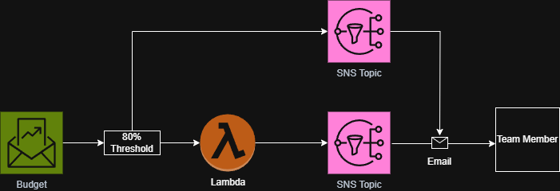

# 🔔 AWS Cost Tracker: Real-Time Budget Alerts  
*Automated cost monitoring with AWS Budgets, Lambda, and SNS*  

[](https://aws.amazon.com) 
[](https://python.org)

## 🧠 Objectives
✅ Cost Visibility: Monitor AWS spend in real-time
✅ Automated Alerts: Trigger notifications at 80%/100% thresholds
✅ Cross-Service Integration: Connect Budgets → Lambda → SNS

## 🛠️ Technologies Used
- **AWS Services**: AWS Budgets, Lambda, and SNS

## 🛠️ Architecture
- AWS Budgets → Lambda → SNS → Email
- 

## 📋 Steps
1. Create SNS Topic and confirm subscription
2. Deploy Lambda function with publish permissions
3. Set AWS Budget with threshold and SNS action
4. Validate alert triggers and log output

## 📸 Visuals
| Results | Image |
|-------------|-------|
| SNS Topic |  |
| SNS Email |  |
| Lambda Test |  |
| Lambda Email |  |

### **4. Code Snippets**
#### **User Data Script** (`scripts/install_httpd.sh`):
```bash
#!/bin/bash
# Install Apache and stress tool
sudo yum update -y
sudo yum install -y httpd stress
sudo systemctl enable --now httpd
echo "<h1>Auto-Healing Lab $(hostname -f)</h1>" | sudo tee /var/www/html/index.html
```

#### **Stress CPU** (`scripts/stress_cpu.sh`):
```bash
# SSH into instance (or use SSM)
sudo amazon-linux-extras install epel -y
sudo yum install stress -y
stress --cpu 2 --timeout 300  # Simulate 100% CPU for 5 mins
```

## 💡 Resume Bullets
**Entry-Level**: “Configured cost monitoring with AWS Budgets and alerting via SNS”  
**Mid-Level**: “Implemented automated cost tracking alerts with Lambda”  
**Advanced**: “Engineered real-time cost control system using AWS Budget triggers and Lambda”

## 🚀 How to Deploy
```bash
# Clone repo
git clone https://github.com/trucle9100/AWS-autohealing-project.git
